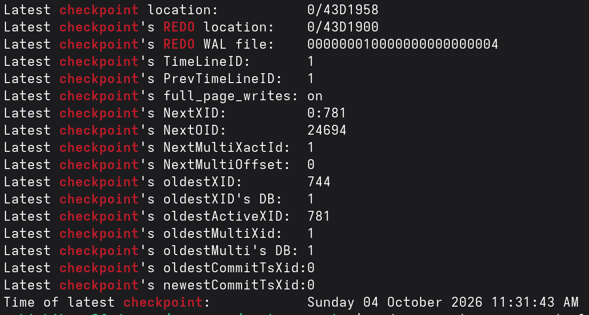
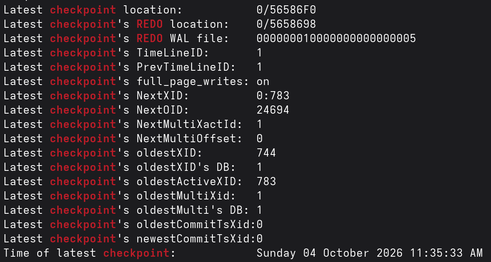

# Manual Checkpoint with Dirty Pages
1. [Setup](#1-setup)
    
    a. [Inference](#inference-)
2. [Create Dirty Pages](#2-create-dirty-pages)
3. [Manual Checkpoint](#3-manual-checkpoint)
    
    a. [Inference](#inference--1)
4. [Side Notes](#side-notes)
5. [Used system catalogs, views, extensions and applications](#used-system-catalogs-views-extensions-and-applications)
6. [References](#references)


## 1. Setup

Get the posgres data directory - <u>***$PGDATA***</u>
```sql
SHOW data_directory
```

`pg_buffercache` - look inside shared buffers

```console
sudo dnf install postgresql-contrib   
```
```sql
CREATE EXTENSION pg_buffercache;
```

`pg_stat_reset_shared()` function from `pg_stat_recovery_prefetch` view resets the stats montiored `pg_stat_checkpointer`

```sql
SELECT pg_stat_reset_shared('checkpointer');
```

Current WAL location + name
```sql
SELECT pg_current_wal_lsn(), pg_walfile_name(pg_current_wal_lsn());
-- "0/43D1A08"	"000000010000000000000004"
```

Number of dirty buffers out of total buffers
```sql
SELECT count(*) FILTER (WHERE isdirty) AS dirty, count(*) AS total FROM pg_buffercache;
-- 0	16384
```

Latest checkpoint and redo's location from the `pg_control` file
```console
sudo -u postgres pg_controldata <$PGDATA> | grep -iE "checkpoint|redo"
```


### Inference : 

Current WAL LSN before requested checkpoint : 0/43D1A08

Time line = 00000001 | Segment group number = 00000000 | Segment number = 00000004

Latest checkpoint location: 0/43D1958

Latest checkpoint's REDO location: 0/43D1900

Latest checkpoint's REDO WAL file: 000000010000000000000004

Latest checkpoint's TimeLineID: 1

Latest checkpoint's PrevTimeLineID: 1

Latest checkpoint's full_page_writes: on	

XLOG_CHECKPOINT_REDO and XLOG_CHECKPOINT_ONLINE records have fixed size regardless of workload.

| Record | Header (XlogRecord) | Data header (main data < 256 bytes) | Payload | xl_tot_len | Total space in WAL (8-byte aligned) |
| --- | --- | --- | --- | --- | --- |
| XLOG_CHECKPOINT_REDO | 24 | 2 | 4 (int wal_level) | 30 | 32 bytes |
| XLOG_CHECKPOINT_ONLINE | 24 | 2 | 88 (CheckPoint struct) | 114 | 120 bytes |
| XLOG_RUNNING_XACTS | 24 | 2 | 24 | 50 | 56 bytes |


The current WAL is 176 (0xB0) bytes past the checkpoint record's start. 
The checkpoint record takes 120 of those (24 header + 2 data header + 88 payload, padded to 8-byte alignment); the remaining 56 bytes are consistent with a single empty RUNNING_XACTS record. 
The REDO pointer is 88 (0x58) bytes before the checkpoint record: 32 for XLOG_CHECKPOINT_REDO plus 56, again consistent with one empty RUNNING_XACTS.
Which implies the server was probably idle or generated practically no WAL in between during checkpointing.
The REDO WAL exists in the same file as the current WAL. 
FPW is on so for the first modification to a page after checkpoint's REDO point, a FPI is written in the WAL.

## 2. Create Dirty Pages

Objective:
- Insert a further 200,000 rows (the table already holds 200,000 rows,
  flushed by an earlier checkpoint, so it has 400,000 rows after the insert)
- Amount of WAL written
- Amount of pages table occupies post insertion
- Dirtied buffers in shared buffers

Generate small table with 400_000 rows (200_000 already inserted)
```sql
CREATE TABLE lab_dirty (id int, pad text);
INSERT INTO lab_dirty SELECT g, md5(g::text) FROM generate_series(1, 200000) g;
```

Table size
```sql
SELECT pg_size_pretty(pg_relation_size('lab_dirty')) AS size,
       pg_relation_size('lab_dirty') / 8192 AS pages;
-- "26 MB"	3334      
```

Current WAL location + How much WAL generated
```sql
SELECT pg_current_wal_lsn(),
       pg_walfile_name(pg_current_wal_lsn()),
       pg_size_pretty(pg_current_wal_lsn() - '0/43D1A08'::pg_lsn) AS wal_generated;
-- "0/5658698"	"000000010000000000000005"	"19 MB"
```

Overall dirty buffers + ones belonging to lab_dirty
```sql
SELECT count(*) FILTER (WHERE isdirty) AS dirty_total,
       count(*) FILTER (WHERE isdirty AND relfilenode = pg_relation_filenode('lab_dirty')) AS dirty_lab
FROM pg_buffercache;
-- 1678	1672
```

> The table `lab_dirty` consists of 3334 pages (26 MB). Insertion generated 19 MB of WAL + resulted in 1672 dirty pages. 

## 3. Manual Checkpoint

```sql
CHECKPOINT;
```
Dirty pages post checkpoint
```sql
SELECT count(*) FILTER (WHERE isdirty) AS dirty FROM pg_buffercache;
-- 0
```
Number of timed and requested checkpoints and dirty buffers written during checkpointing
```sql
SELECT num_timed, num_requested, buffers_written FROM pg_stat_checkpointer;
-- 0	1	1678
```
Current WAL location and filename
```sql
SELECT pg_current_wal_lsn(), pg_walfile_name(pg_current_wal_lsn());
-- "0/565BB60"	"000000010000000000000005"
```

```console
sudo -u postgres pg_waldump -p <$PGDATA>/pg_wal -s 0/5658698 -e 0/565BB60 000000010000000000000005
```


```console
sudo -u postgres pg_waldump -p <$PGDATA>/pg_wal -s 0/5658698 -e 0/565BB60 000000010000000000000005
```

```console
rmgr: XLOG        len (rec/tot):     30/    30, tx:          0, lsn: 0/05658698, prev 0/05658660, desc: CHECKPOINT_REDO wal_level replica

rmgr: Standby     len (rec/tot):     50/    50, tx:          0, lsn: 0/056586B8, prev 0/05658698, desc: RUNNING_XACTS nextXid 783 latestCompletedXid 782 oldestRunningXid 783

rmgr: XLOG        len (rec/tot):    114/   114, tx:          0, lsn: 0/056586F0, prev 0/056586B8, desc: CHECKPOINT_ONLINE redo 0/5658698; tli 1; prev tli 1; fpw true; wal_level replica; xid 0:783; oid 24694; multi 1; offset 0; oldest xid 744 in DB 1; oldest multi 1 in DB 1; oldest/newest commit timestamp xid: 0/0; oldest running xid 783; online

rmgr: Standby     len (rec/tot):     50/    50, tx:          0, lsn: 0/05658768, prev 0/056586F0, desc: RUNNING_XACTS nextXid 783 latestCompletedXid 782 oldestRunningXid 783

rmgr: XLOG        len (rec/tot):     49/  5149, tx:          0, lsn: 0/056587A0, prev 0/05658768, desc: FPI_FOR_HINT , blkref #0: rel 1663/5/1247 blk 14 FPW

rmgr: XLOG        len (rec/tot):     49/  8013, tx:          0, lsn: 0/05659BC0, prev 0/056587A0, desc: FPI_FOR_HINT , blkref #0: rel 1663/5/2610 blk 0 FPW

rmgr: Standby     len (rec/tot):     50/    50, tx:          0, lsn: 0/0565BB28, prev 0/05659BC0, desc: RUNNING_XACTS nextXid 783 latestCompletedXid 782 oldestRunningXid 783
```

### Inference : 

The checkpoint record is 88 bytes away from REDO record. 32 bytes for XLOG_CHECKPOINT_REDO plus remaining 56 bytes are consistent with one empty RUNNING_XACTS record. The current WAL LSN is 13,512 (~13 KB) bytes away from the REDO point. The curent WAL LSN is 13424 bytes away from the checkpoint record. 

Between the checkpoint record and the current WAL LSN there is 13424 bytes. There are 2 RUNNING_XACTS records (56 x 2 = 112 bytes), checkpoint record being 120 bytes. Remaining 13192 bytes consists of the 2 FPI_FOR_HINT records. 

The first FPI_FOR_HINT is 5149 bytes padded to 5152 bytes : tablespace 1663 (pg_default), database 5 (typically postgres), relfilenode 1247, block 14 (first page).

Which relation's FPI
```sql
SELECT pg_filenode_relation(1663, 1247);
-- pg_type
```


The second FPI_FOR_HINT is 8040 bytes based on the substraction between the next record's LSN and it's own LSN: tablespace 1663 (pg_default), database 5 (typically postgres), relfilenode 2610, block 0 (first page). 

Which relation's FPI
```sql
SELECT pg_filenode_relation(2610);
-- pg_index
```

But in the `len (rec/tot): 49/  8013` the total is 8013 bytes padded to 8016 bytes. 

Where does the remaining 24 bytes come from ?

8192 bytes is 0x2000 in hex, so page boundaries always fall at addresses ending in 0000, 2000, 4000, 6000, 8000, A000, C000, E000. Records ignore this grid. They are laid end to end wherever the previous one ended, and a long record can cross a boundary.

A 16 MB WAL segment holds 16 MB / 8 KB = 2048 pages.
Every page starts with a page header: 24 bytes normally, 40 bytes for the first page of a segment. Page headers are not part of any record's xl_tot_len.

FPI #1 lies in the page starting at 0/05658000, at offset 0x7A0 = 1952.
FPI #2 also starts in that page, at offset 0x9BC0 - 0x8000 = 0x1BC0 = 7104.
The space left in the page is 8192 - 7104 = 1088 bytes.
FPI #2 takes 8016 bytes (8013 padded to a multiple of 8), so 1088 bytes fit in
the first page and the remaining 8016 - 1088 = 6928 bytes continue in the next
page, after its 24-byte page header.

The gap between FPI #2 and the next record is 0x565BB28 - 0x5659BC0 = 8040.
That is 8016 (record) + 24 (page header of the next page). The header bytes
belong to neither record, so they appear only in the LSN distance.

```
0/05658000 (start of an 8KB page)
....
-> 0/05658698 CHECKPOINT_REDO
-> 0/056586B8 RUNNING_XACTS
-> 0/056586F0 CHECKPOINT_ONLINE
-> 0/05658768 RUNNING_XACTS
-> 0/056587A0 FPI_FOR_HINT #1 (starts here, crosses the page boundary)
-> 0/05659BC0 FPI_FOR_HINT #2 
....
0/0565A000 (start of the next 8 KB page) ((24-byte page header: A000-A017))
....
-> 0/0565BB28 RUNNING_XACTS
```

The previous checkpoint started at 11:31:43. With the default checkpoint_timeout
of 5 min, the next timed checkpoint was due at 11:36:43. The manual CHECKPOINT
started at 11:35:33, about 70 seconds earlier, so it replaced that timed
checkpoint rather than running in addition to it. After it finished, the timer
restarted, so the next timed checkpoint is due about 5 min after the manual one.

This is why pg_stat_checkpointer shows num_timed = 0 and num_requested = 1.
Only about 19 MB of WAL was generated, far below max_wal_size, so no
WAL-triggered checkpoint competed with it. A manual CHECKPOINT also writes all
dirty buffers immediately, without the spreading that checkpoint_completion_target
applies to timed checkpoints.

---

## Side Notes

> Checksums

- Checksums are like fingerprints for each 8KB page of data on disk.

- When PostgreSQL `writes` a page to disk, it runs a math formula for every byte in that page and produces a small 16-bit number. The number is stored in the page header along with the data.

- When PostgreSQL `reads` that page, it re-computes the number and compares it with the stored number in the page header.

- If the data got corrupted (even if one bit gets flipped), a mismatch with the number computed and number stored occurs.

- If checksum field itself gets corrupted then the stored value is wrong but the data is fine resulting in safe failure.

> Hint Bits

- Every row (tuple) in PostgreSQL has a tiny header with 2 transaction IDs: 
	- xmin : which xact created the row
	- xmax : which xact deleted/updated the row
To know if the row reflects to the client, it needs to know if xact xmin commit.

- Everytime a row is read, the xact's status is cross checked in a separate table pg_xact - which is expensive and causes lock contention.

- So the first time the process reads a row and checks the pg_xact for xmin, it writes the status directly into the row's heaer as a 1-bit flag: 
	HEAP_XMIN_COMMITED
	HEAP_XMIN_ABORTED
Now the subsequent reader just checks the flag and skips pg_xact re-lookup.

> FPI_FOR_HINT record

- When a SELECT reads a row from the table - in our case - pg_type and pg_index, the hint bit isn't set yet (it was cleared after the last checkpoint)

- The 1-bit hint flag is flipped in the row header after checking the commited xmin in pg_xact.

- Since the flip changes the page contents - the page's checksum is now stale. With checksums enabled, the full page is written to WAL.


## Used system catalogs, views, extensions and applications

> `pg_buffercache` 

The module provides a means for examining what's happening in the shared buffer cache in real time. It also offers a low-level way to evict data from it, for testing purposes.

> `pg_controldata` 

The server application displays control information of a PostgreSQL database cluster. It prints information initialized during initdb, such as the catalog version. It also shows information about write-ahead logging and checkpoint processing. This information is cluster-wide, and not specific to any one database.

> `pg_stat_recovery_prefetch`

The single row view shows statistics about WAL referenced data blocks prefetched by a standby during recovery. The columns `wal_distance`, `block_distance` and `io_depth` show current values, and the other columns show cumulative cluster-wide counters that can be reset with the `pg_stat_reset_shared` function.

| Column | Description |
| --- | --- |
| stats_reset | Time these stats were last reset |
| prefetch | Blocks prefetched (not in buffer pool) |
| hit | Blocks already in buffer pool |
| skip_init | Blocks skipped (would be zero-initialized) |
| skip_new | Blocks skipped (didn't exist yet) |
| skip_fpw | Blocks skipped (full page write) |
| skip_rep | Blocks skipped (repeated) |
| wal_distance | Current WAL prefetch distance from the replay lsn (not reset) |
| block_distance | Current block prefetch distance (not reset) |
| io_depth | Current I/O requests issued/hinted to the OS (not reset) |


> `pg_stat_checkpointer`

The single-row view contains data about the checkpointer process of the cluster - cumulative till present date.

| Column | Description |
| --- | --- | 
| num_timed	| Checkpoints triggered by `checkpoint_timeout` (includes skipped ones when idle) |
| num_requested | Checkpoints triggered externally (e.g., CHECKPOINT command, `max_wal_size` reached, shutdown) |
| write_time | Total ms spent writing dirty pages to disk during checkpoints/restartpoints |
| sync_time | Total ms spent fsync'ing those pages to disk |
| buffers_written | Total number of shared buffers (8 KB pages) written during checkpoints/restartpoints |
| stats_reset | Timestamp of last reset |

restartpoints_timed, restartpoints_donea are columns revelant for standby.

> Functions used

pg_size_pretty()
pg_walfile_name()
pg_relation_size()
pg_current_wal_lsn()
pg_stat_reset_shared()
pg_relation_filenode()

---

## References

[pg_buffercache](https://www.postgresql.org/docs/current/pgbuffercache.html)

[pg_controldata](https://www.postgresql.org/docs/current/app-pgcontroldata.html)